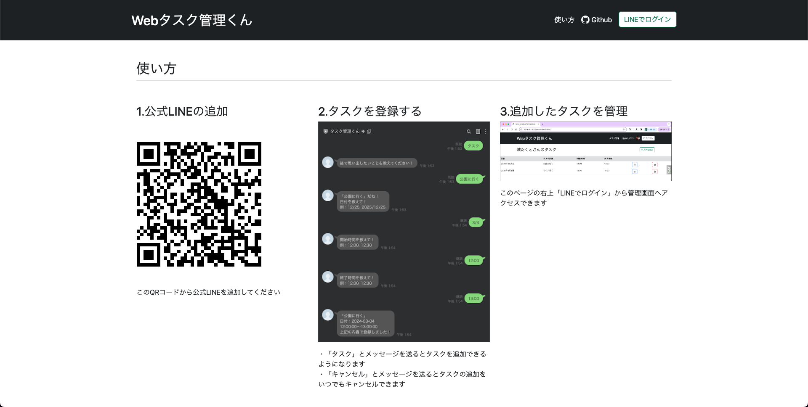

# タスク管理くん

LINEと連携したタスク管理ツールです 
LINEのBotにメッセージを送ってタスクを追加できます 
追加したタスクはWebサイトで管理することができます 
<a href="https://mi8150jo.com">Webタスク管理くん</a>

 
ログイン前の画面 

ログイン後の画面 

# 使用技術

## 主な使用技術一覧
<table>
    <!-- ヘッダ -->
    <tr>
        <td>言語</td>
        <td>ライブラリ・フレームワーク</td>
        <td>ミドルウェア</td>
        <td>エディタ</td>
        <td>クラウド</td>
    </tr>
    <!-- ボディ -->
    <tr>
    <!-- 言語 -->
        <td>
            
             
            
             
            
        </td>
    <!-- ライブラリ・フレームワーク -->
        <td>
            
             
            
             
            
             
        </td>
    <!-- ミドルウェア -->
        <td>
            
             
            
             
            
        </td>
    <!-- エディタ -->
        <td>
            
        </td>
    <!-- クラウド -->
        <td>
            
        </td>
    </tr>
  </table>

## requirements.txt
asgiref==3.7.2 
certifi==2024.2.2 
cffi==1.16.0 
charset-normalizer==3.3.2 
cryptography==42.0.5 
defusedxml==0.7.1 
Django==5.0.1 
django-allauth==0.61.0 
django-bootstrap5==23.4 
django-debug-toolbar==4.3.0 
gunicorn==21.2.0 
idna==3.6 
oauthlib==3.2.2 
packaging==23.2 
pycparser==2.21 
PyJWT==2.8.0 
pysqlite3==0.5.2 
pysqlite3-binary==0.5.2.post3 
python-dateutil==2.8.2 
python-decouple==3.8 
python3-openid==3.2.0 
requests==2.31.0 
requests-oauthlib==1.3.1 
six==1.16.0 
sqlparse==0.4.4 
urllib3==2.2.1 

## AWS構成図

# 機能一覧
<ul>
    <li>Lineログイン機能</li>
    <li>LineBotの応答からタスク追加</li>
    <li>Lineのユーザー名表示</li>
    <li>Lineのアイコン表示</li>
    <li>CRUD</li>
    <ul>
        <li>タスクの表示</li>
        <li>タスクをクリックして詳細表示</li>
        <li>タスクの削除</li>
        <li>タスクの編集</li>
        <li>タスクの追加</li>
        <li>過去のタスク表示（今日より前のタスク)</li>
        <li>過去のタスク追加</li>
    </ul>

</ul>
